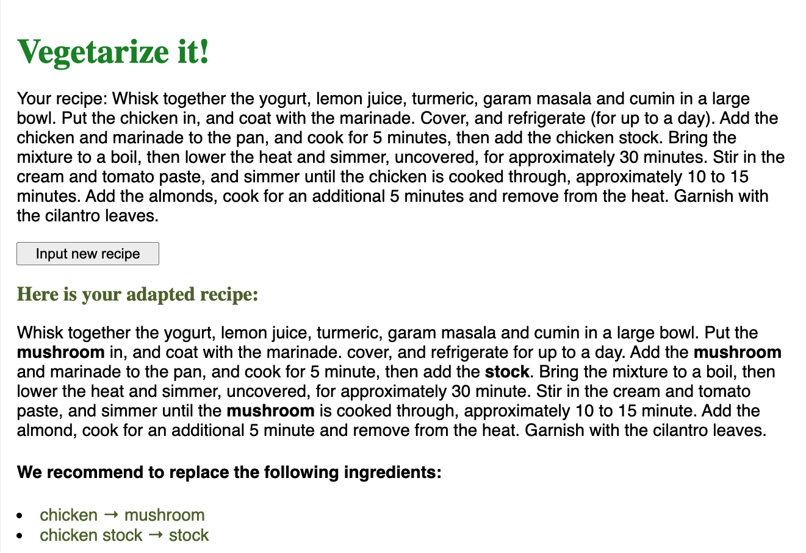

# Vegetarize_It

Detects meat products in recipes and replaces them with a suitable vegetarian alternative.

Based on [FoodBERT](https://github.com/ChantalMP/Exploiting-Food-Embeddings-for-Ingredient-Substitution).

